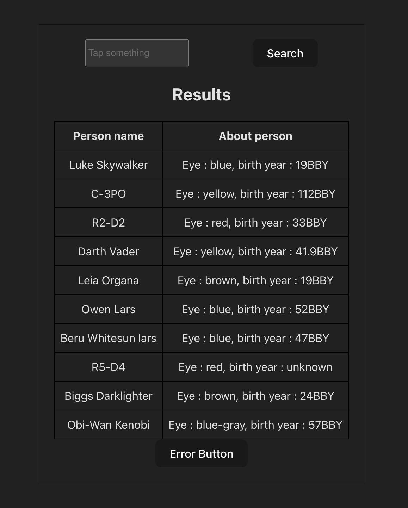
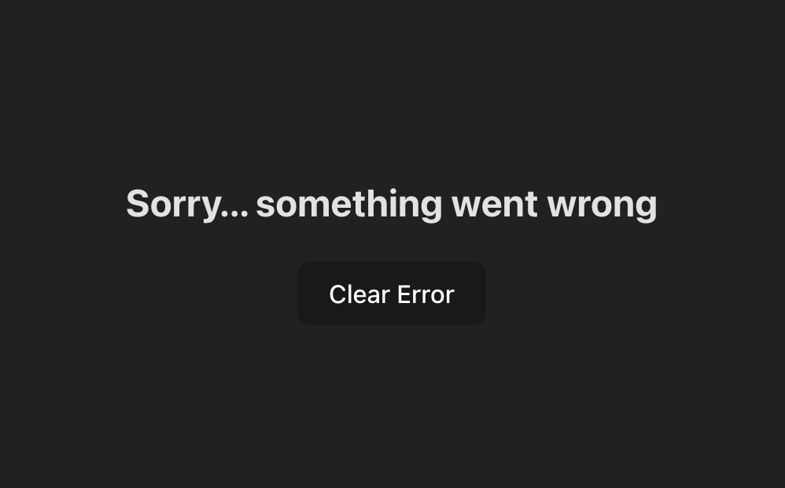

# RS School React course 2025 Q1

## Task

1. [Link to the task description](https://github.com/rolling-scopes-school/tasks/blob/master/react/modules/tasks/class-components.md)
2. Screenshots:

3. Deployment: [link](https://q1-task.netlify.app/)
4. Submission Date: 2025-01-30 14:40
5. Deadline Date: 2025-02-03 06:59
6. Self-check: 100 / 100
